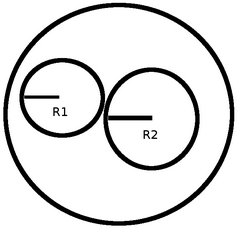

# Desafios Iniciais Java - Santander Fullstack Developer

## Desafio 1

Você tem em mãos dois cabos circulares de energia. O primeiro cabo tem raio R1 e o segundo raio R2. Você precisa comprar um conduite circular (veja a imagem abaixo que ilustra um conduite) de maneira a passar os dois cabos por dentro dele:

Qual o menor raio do conduite que você deve comprar? Em outras palavras, dado dois círculos, qual o raio do menor círculo que possa englobar ambos os dois?

## Desafio 2

Calibrar os pneus do carro deve ser uma tarefa cotidiana de todos os motoristas. Para isto, os postos de gasolina possuem uma bomba de ar. A maioria das bombas atuais são eletrônicas, permitindo que o motorista indique a pressão desejada num teclado. Ao ser ligada ao pneu, a bomba primeiro lê a pressão atual e calcula a diferença de pressão entre a desejada e a lida. Com esta diferença ela esvazia ou enche o pneu para chegar na pressão correta.

Sua ajuda foi requisitada para desenvolver o programa da próxima bomba da SBC - Sistemas de Bombas Computadorizadas.

Escreva um programa que, dada a pressão desejada digitada pelo motorista e a pressão do pneu lida pela bomba, indica a diferença entre a pressão desejada e a pressão lida.

## Desafio 3

Seu Júlio é proprietário de um grande apiário situado no interior da Paraíba. Todo ano, semestralmente, seu Júlio coleta o mel produzido pelas abelhas da sua propriedade e armazena-o em um recipiente de formato CILÍNDRICO para que facilite o transporte do mel para os estabelecimentos que encomendam esse produto natural para a comercialização.
Certa vez seu Júlio percebeu que devido a um crescimento na produção do mel, em relação ao semestre anterior, o recipiente que possuia não suportaria o volume de mel produzido por suas abelhas. Seu Júlio precisa agora que você faça um programa que informado o volume de mel em cm3 e o diâmetro da parte interna do recipiente em cm, calcule e mostre:

- Qual deve ser a altura(em cm) da parte interna do recipiente;

- A área(em cm2) da boca(entrada) do recipiente.

Obs.: Considere π = 3.14
