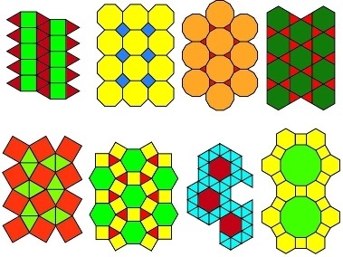

# Desafio 1

Guilherme adora brincar com pipas, pipas de várias cores, formas e tamanhos. Ele tem percebido que para as pipas possuírem maior estabilidade, e dessa forma voarem mais alto, elas devem possuir um barbante bem esticado ligando todos os pares de pontas não vizinhas.

Apesar de ser uma criança bastante criativa e astuta, Guilherme não sabe como determinar a quantidade de barbantes que ele terá que utilizar para tornar uma pipa de n lados, estável. Você pode ajudá-lo?.

# Desafio 2

Na geometria Euclidiana, um polígono regular é um polígono em que todos os ângulos são iguais e todos os lados tem o mesmo comprimento. Um polígono simples é aquele cujos segmentos de reta não se interceptam. Abaixo pode-se ver vários mosaicos feitos por polígonos regulares.

Você deve escrever um programa que, dados o número e o comprimento dos lados de um polígono regular, mostre seu perímetro.

# Desafio 3

Faça um programa que calcule e mostre o volume de uma esfera sendo fornecido o valor de seu raio (R). A fórmula para calcular o volume é: (4/3) * pi * R3. Considere (atribua) para pi o valor 3.14159.

Dica: Ao utilizar a fórmula, procure usar (4/3.0) ou (4.0/3), pois algumas linguagens (dentre elas o C++), assumem que o resultado da divisão entre dois inteiros é outro inteiro.
